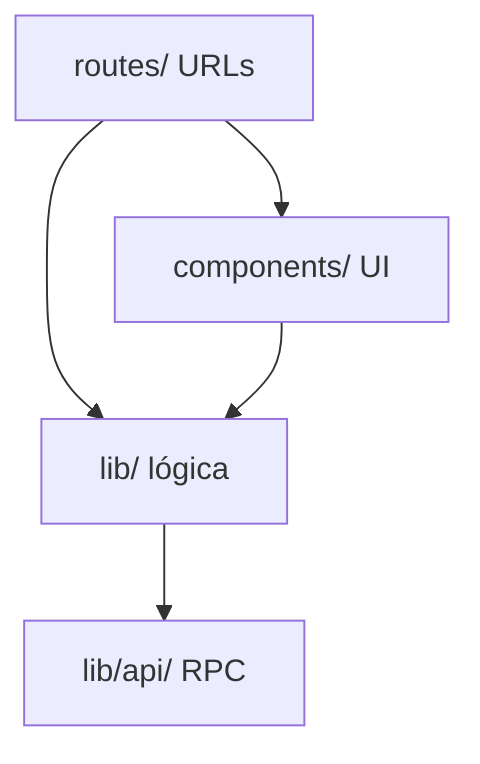

# Arquitetura NorFood

SaaS multi-tenant para restaurantes e delivery. O código web vive em `src/` e segue **três camadas por tipo**, com **subpastas por domínio** dentro de cada camada.

## Camadas

```
src/
├── routes/       # URLs (TanStack Router, file-based)
├── components/   # UI React
└── lib/          # Lógica de negócio, server helpers, integrações
    ├── api/      # Server functions (createServerFn)
    └── shared/   # Infraestrutura transversal
```



### Onde colocar código novo

| Tipo | Local |
|------|-------|
| Nova página / URL | `src/routes/` |
| Componente visual | `src/components/{dominio}/` |
| Lógica de negócio, hooks, context | `src/lib/{dominio}/` |
| Endpoint server (RPC) | `src/lib/api/{dominio}/*.functions.ts` |
| Implementação server-only | `src/lib/api/{dominio}/*.server.ts` ou `src/lib/{dominio}/*.server.ts` |
| Utilitário usado por vários domínios | `src/lib/shared/` |
| Primitivos UI (shadcn) | `src/components/ui/` |
| Componentes compostos do painel | `src/components/design-system/` |

**Regra:** configuração e tipos ficam em `lib/`; JSX fica em `components/`. Ex.: `lib/painel/painel-configuracoes.tsx` (dados) + `components/painel/painel-configuracoes-ui.tsx` (UI).

## Domínios

| Domínio | `lib/` | `components/` | `lib/api/` |
|---------|--------|---------------|------------|
| **shared** | `shared/` | `shared/` | — |
| **tenant** | `tenant/` | `tenant/` | `tenant/` |
| **auth** | `auth/` | — | `auth/` |
| **loja** | `loja/` | `loja/` | — |
| **painel** | `painel/` | `painel/` | `tenant/painel-data.*` |
| **pedidos** | `pedidos/` | `pedidos/` | `pedidos/` |
| **delivery** | `delivery/` | `delivery/` | `delivery/` |
| **entregador** | `entregador/` | `entregador/` | — |
| **produtos** | `produtos/` | `loja/` (formulários) | `produtos/` |
| **colaboradores** | `colaboradores/` | `colaboradores/` | `tenant/colaboradores.*` |
| **atendimento** | `atendimento/`, `waba/` | `atendimento/` | `atendimento/` |
| **fiscal** | `fiscal/` | `fiscal/` | `fiscal/` |
| **financeiro** | `platform/` | `billing/` | `financeiro/` |
| **relatórios** | `relatorios/` | — | `relatorios/` |
| **plataforma** | `platform/`, `platform-admin/`, `signup/` | `admin/` | `plataforma/` |
| **demo** | `demo/` | — | — |
| **landing** | `brand/` | `landing/` | — |

Pastas já consolidadas que não mudam de propósito: `integrations/supabase/`, `fiscal/`, `waba/`, `signup/`, `platform-admin/`.

## Convenções de nomes

| Padrão | Uso |
|--------|-----|
| `*.functions.ts` | RPC exposta ao cliente (`createServerFn`) |
| `*.server.ts` | Código server-only (não importar no cliente) |
| `*-lazy.tsx` | Wrapper de dynamic import (code-splitting) |
| `painel.*.tsx` (em routes) | Rota aninhada `/painel/...` |
| `-*.tsx` (em routes) | Arquivo compartilhado, não vira rota |
| `_authenticated/` | Layout com auth, `ssr: false` |

`routeTree.gen.ts` é gerado automaticamente — não editar.

## Mapa rota → domínio

| Prefixo de rota | Domínio |
|-----------------|---------|
| `painel.kds`, `painel.pdv`, `painel.mesas`, `painel.pedidos.*` | pedidos |
| `painel.delivery`, `entregador.*` | delivery |
| `painel.atendimento.*`, `api/whatsapp`, `api/waba` | atendimento |
| `painel.fiscal.*` | fiscal |
| `painel.financeiro.*`, `painel.estabelecimento.plano` | financeiro |
| `painel.produtos.*`, `painel.cupons` | produtos |
| `loja.*`, `cardapio.*` | loja |
| `t.$tenantSlug.*`, `selecionar-empresa`, `conta-suspensa.*` | tenant |
| `admin.*` | plataforma |
| `cadastro*` | signup |

URLs canônicas do painel: `/t/:tenantSlug/*` (legado `/painel/*` redireciona).

## Multitenancy

- Contexto: `lib/tenant/tenant-context.tsx`
- Tenant ativo: `lib/tenant/active-tenant.ts`
- Filtro DB: `lib/tenant/query-filter.ts` (`withTenantId`)
- Registry do painel: `lib/tenant/tenant-painel-registry.tsx`

## O que não mover

- Arquivos em `src/routes/` (requisito TanStack Router)
- `routeTree.gen.ts`
- Pacote `mobile/` (Expo, separado)
- Monólitos grandes nesta fase (`app-abelha-mel.tsx`, `atendimento-inbox.tsx`, etc.) — apenas mudam de pasta, não são divididos

## Referências

- [Convenções de rotas](../src/routes/README.md)
- [Deploy em produção](../deploy/PRODUCTION.md)
- [Remediação de segurança](./SECURITY-REMEDIATION.md)
